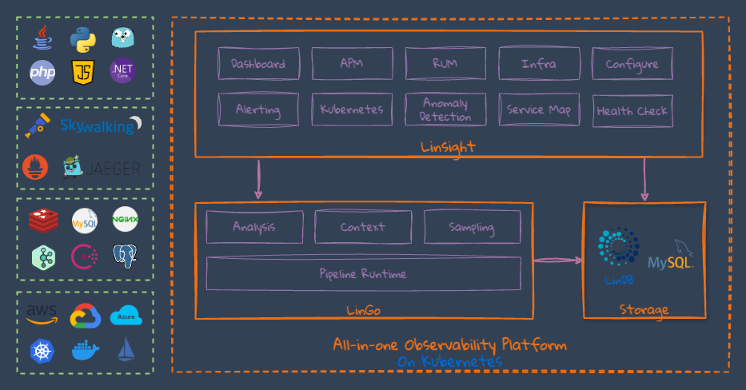

Open Source Observability Platform

At [Lin](https://lindb.io), our commitment to Open Source and Open Standards drives our innovation in observability. 
A significant portion of our code, designed to enhance the observability of systems through metrics, logs, and traces, is freely available for your use.
Explore our repositories to access these powerful tools and help democratize observability for everyone.

## LLL Stack
The LLL Stack comprises the following innovative products:

* [Linsight](https://github.com/lindb/linsight): An open-source, comprehensive observability platform designed to monitor your applications effectively.
* [LinGo](https://github.com/lindb/lingo): A lightweight, SQL-like pipeline for streamlined observability.
* [LinDB](https://github.com/lindb/lindb): A scalable, high-performance, and highly available distributed time series database.

Explore our projects to enhance your observability solutions and contribute to the community.
